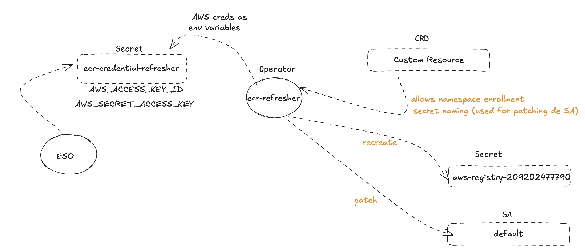

## ECR-creds-refresher

* Prereq: A secret that holds the `AWS_ACCESS_KEY_ID` and `AWS_SECRET_ACCESS_KEY` the secret can be in any namespace.
  
* Install:

  
```bash
# add repo
helm repo add demo https://dejanu.github.io/ecr-creds-refresher/packages
helm search repo demo

# install operator 
helm install operator demo/ecr-creds-refresher --namespace TARGET_NAMESPACE \
  --create-namespace \
  --set aws.credentials.secretName=SECRET_HOLDING_AWS_CREDS \
  --set aws.credentials.namespace=SECRET_NAMESPACE \
  --set aws.region=us-east-1 \
  --set aws.registry=YOUR_ACCOUNT_ID.dkr.ecr.us-east-1.amazonaws.com

```


1. Operator Startup
   ↓
2. Reads AWS Credentials (from configured secret in any namespace)
   ↓
3. Watches for ECRPullSecret CRs (Custom Resources)
   ↓
4. When CR Created/Updated/Resumed:
   - Fetches fresh ECR token from AWS (valid 12 hours)
   - Creates/updates Docker registry secret in each listed namespace
   - Patches default ServiceAccount to use the secret
   ↓
5. Timer (Every 6 Hours):
   - Re-fetches fresh ECR token
   - Updates all secrets in all namespaces from all CRs
   ↓
6. When CR Deleted:
   - Logs cleanup instructions (doesn't auto-delete secrets)

  ---

  Options to configure your cluster (i.e. k3s) to pull from a private repo (i.e. in ECR):

  * Configure **containerd** to connect to [private registry](https://docs.k3s.io/installation/private-registry) via `/etc/rancher/k3s/registries.yaml` config.
    
  * Configure a [credential provider plugin](https://kubernetes.io/docs/tasks/administer-cluster/kubelet-credential-provider/) to be used by the kubelet
  `/var/lib/rancher/k3s/agent/etc/containerd/config.toml `.

  * Use `ecr-creds-refresher`: 

   
  
  

